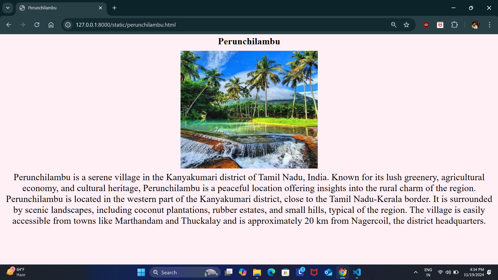
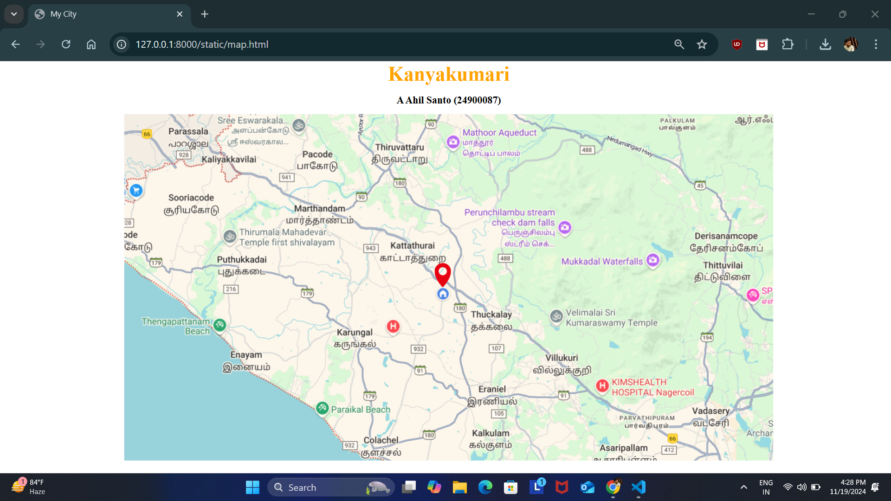
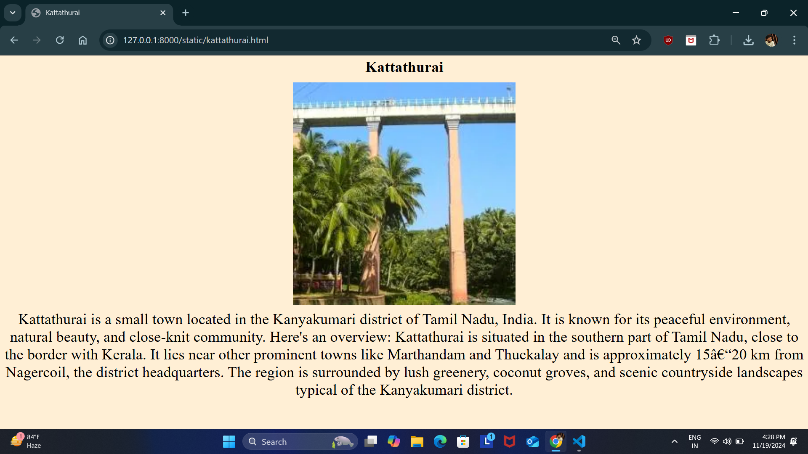
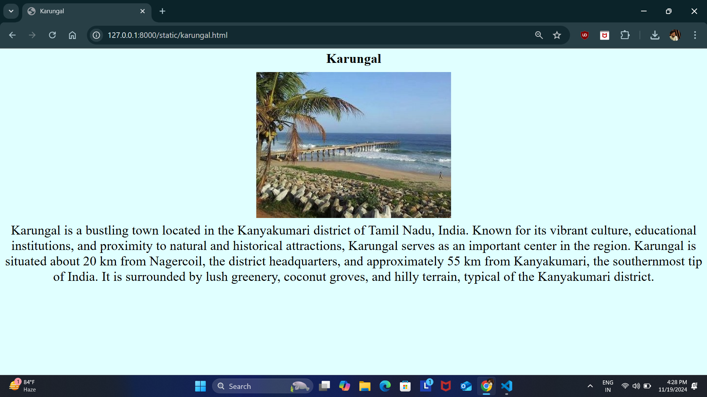
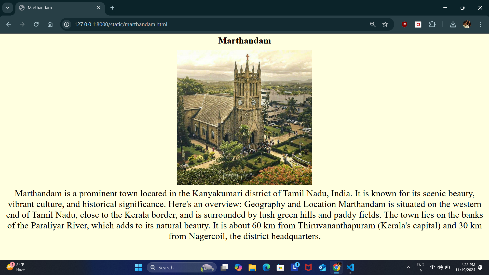
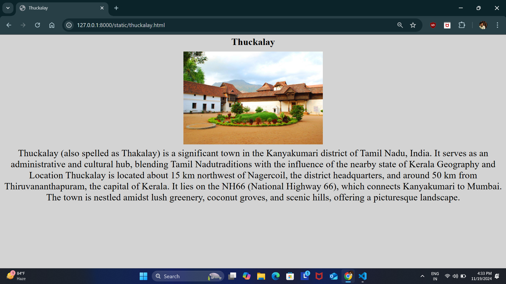

# Ex04 Places Around Me
## Date: 19.11.24

## AIM
To develop a website to display details about the places around my house.

## DESIGN STEPS

### STEP 1
Create a Django admin interface.

### STEP 2
Download your city map from Google.

### STEP 3
Using ```<map>``` tag name the map.

### STEP 4
Create clickable regions in the image using ```<area>``` tag.

### STEP 5
Write HTML programs for all the regions identified.

### STEP 6
Execute the programs and publish them.

## CODE

```
map.html

<html>
    <head>
        <title>My City</title>
    </head>
    <body>
        <h1 align = "center">
            <font color="orange" size ="10"><b>Kanyakumari</b></font> 
        </h1>
        <h3 align="center">
            <font color="black" size ="5"><b>A Ahil Santo (24900087)</b></font>
        </h3>
        <center>
            

            <map name="image-map">
                <area target="" alt="marthandam" title="marthandam" href="marthandam.html" coords="381,201,556,279" shape="rect">
                <area target="" alt="thuckalay" title="thuckalay" href="thuckalay.html" coords="867,492,73" shape="circle">
                <area target="" alt="karungal" title="karungal" href="karungal.html" coords="544,533,68" shape="circle">
                <area target="" alt="kattathurai" title="kattathurai" href="kattathurai.html" coords="602,293,769,361" shape="rect">
                <area target="" alt="perunchilambu" title="perunchilambu" href="perunchilambu.html" coords="772,232,794,248,847,268,874,290,881,321,939,324,1022,326,1051,312,1066,279,1071,240,1055,210,904,205,792,205,761,205,760,221" shape="poly">
            </map>
        </center>
    </body>
</html>


marthandam.html

<html>
    <head>
        <title>Marthandam</title>
    </head>
    <body bgcolor="lightyellow">
        <h1 align="center">
            <font size="80"><b>Marthandam</b></font>
        </h1>
        <center></center>
        
        <p align ="center">
            <font size="15">Marthandam is a prominent town located in the Kanyakumari district
                of Tamil Nadu, India. It is known for its scenic beauty, vibrant culture, and historical significance. Here's an overview:
                Geography and Location
                Marthandam is situated on the western end of Tamil Nadu, close to the Kerala border, and is surrounded by lush green hills and paddy fields.
                The town lies on the banks of the Paraliyar River, which adds to its natural beauty.
                It is about 60 km from Thiruvananthapuram (Kerala's capital) and 30 km from Nagercoil, the district headquarters.</font>
            

        </p>
    </body>
    
</html>


thuckalay.html

<html>
    <head>
        <title>Thuckalay</title>
    </head>
    <body bgcolor="lightgray">
        <h1 align="center">
            <font size="80"><b>Thuckalay</b></font>
        </h1>
        <center></center>
        
        <p align ="center">
            <font size="15">Thuckalay (also spelled as Thakalay) is a significant town in the Kanyakumari district of Tamil Nadu, India. It serves as an administrative and cultural hub, blending Tamil Nadutraditions with the influence of the nearby state of Kerala
                Geography and Location
                Thuckalay is located about 15 km northwest of Nagercoil, the district headquarters, and around 50 km from Thiruvananthapuram, the capital of Kerala.
                It lies on the NH66 (National Highway 66), which connects Kanyakumari to Mumbai.
                The town is nestled amidst lush greenery, coconut groves, and scenic hills, offering a picturesque landscape.</font>
            

        </p>
    </body>
    
</html>


karungal.html

<html>
    <head>
        <title>Karungal</title>
    </head>
    <body bgcolor="LightCyan ">
        <h1 align="center">
            <font size="80"><b>Karungal</b></font>
        </h1>
        <center></center>
        
        <p align ="center">
            <font size="15">Karungal is a bustling town located in the Kanyakumari district of Tamil Nadu, India. Known for its vibrant culture, educational institutions, and proximity to natural and historical attractions, Karungal serves as an important center in the region.
                Karungal is situated about 20 km from Nagercoil, the district headquarters, and approximately 55 km from Kanyakumari, the southernmost tip of India.
                It is surrounded by lush greenery, coconut groves, and hilly terrain, typical of the Kanyakumari district.
            </font>
            

        </p>
    </body>
    
</html>


kattathurai.html

<html>
    <head>
        <title>Kattathurai</title>
    </head>
    <body bgcolor="#FFEFD5">
        <h1 align="center">
            <font size="80"><b>Kattathurai</b></font>
        </h1>
        <center></center>
        
        <p align ="center">
            <font size="15">Kattathurai is a small town located in the Kanyakumari district of Tamil Nadu, India. It is known for its peaceful environment, natural beauty, and close-knit community. Here's an overview:
                Kattathurai is situated in the southern part of Tamil Nadu, close to the border with Kerala.
It lies near other prominent towns like Marthandam and Thuckalay and is approximately 15–20 km from Nagercoil, the district headquarters.
The region is surrounded by lush greenery, coconut groves, and scenic countryside landscapes typical of the Kanyakumari district.
            </font>
            

        </p>
    </body>
    
</html>


perunchilambu.html

<html>
    <head>
        <title>Perunchilambu</title>
    </head>
    <body bgcolor="#FFF0F5">
        <h1 align="center">
            <font size="80"><b>Perunchilambu</b></font>
        </h1>
        <center></center>
        
        <p align ="center">
            <font size="15">Perunchilambu is a serene village in the Kanyakumari district of Tamil Nadu, India. Known for its lush greenery, agricultural economy, and cultural heritage, Perunchilambu is a peaceful location offering insights into the rural charm of the region.
                Perunchilambu is located in the western part of the Kanyakumari district, close to the Tamil Nadu-Kerala border.
It is surrounded by scenic landscapes, including coconut plantations, rubber estates, and small hills, typical of the region.
The village is easily accessible from towns like Marthandam and Thuckalay and is approximately 20 km from Nagercoil, the district headquarters.
            </font>
            

        </p>
    </body>
    
</html>

```

## OUTPUT














## RESULT
The program for implementing image maps using HTML is executed successfully.
